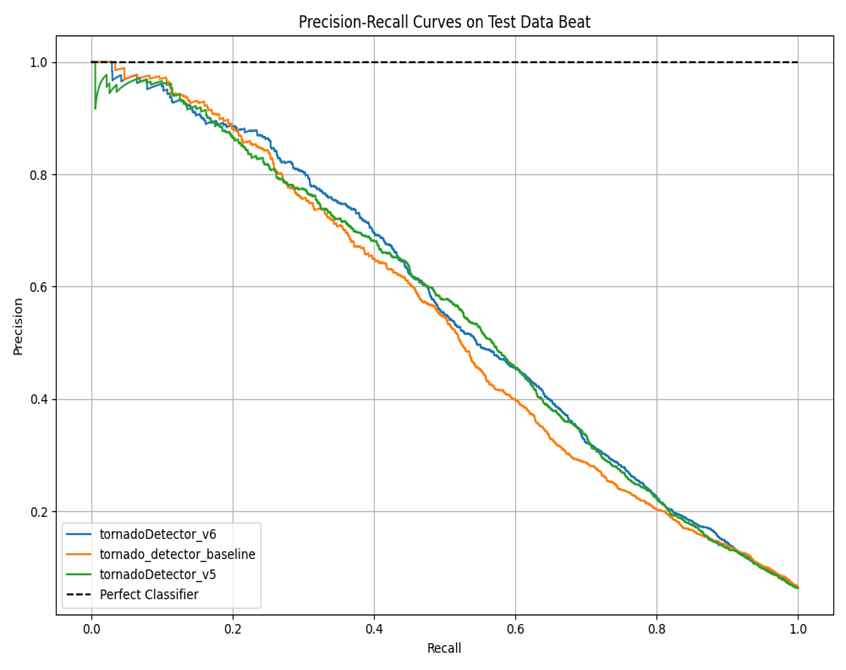
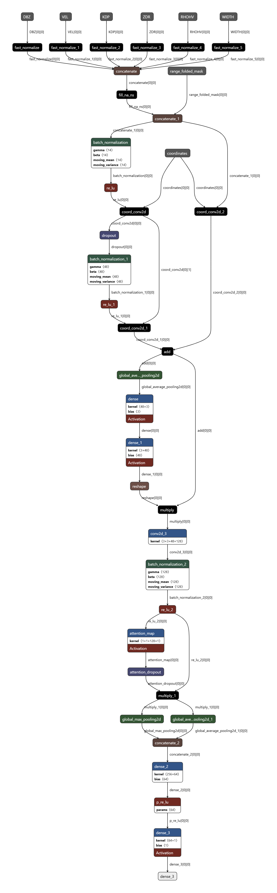

# 🌀 Tornado Prediction with Wide ResNet Ensembles update 5-15-2025

This contribution extends the [Tornet benchmark](https://github.com/mit-ll/tornet) with optimized deep learning architectures for tornado detection using polarimetric radar data. The focus is on enhancing performance via model refinement and ensembling, culminating in a lightweight and high-performing prediction pipeline that utilizes wide_resnet with a gated mechanism, as well as an 85 percent reduction in memory

---

## 📌 Overview (Update 5-15-2025)

This project
- Cosine decay with warmup also replaces Exponential Decay
- The five fold ensemble does do better on AUC and AUCPR but is slightly worse on other metrics
- Additionally, the best combo is technically fold1+fold5, but it is likely an unfair overfit ensemble that was overpeeking anyway, as we can't pick and choose the folds that go into an ensemble that would be cheating :)
- The ensemble of five may not justify its parameter count frankly, but overall still technically does better on AUC and AUCPR.
- I added a new script so that you can point to a folder, put in the threshold and it will calculate the test score off of that, so you don't have to put the path of every file in the CLI
- 
---
### Increase in Performance Across Metrics(Relative to WRN+Gated ensemble)

| Metric             | Improvement |
|--------------------|-------------|
| AUC                | 0.54%       |
| AUCPR              | 2.59%       |
| Binary Accuracy    | 0.07%       |
| More True Positives | 57         |
| More False Positives| 33         |
|Diff                 | 24         |
| Precision          | 0.27%       |
| Recall             | 5.84%       |
| False Alarm Rate   | -0.40%      |
| F1-Score           | 3.25%       |
| Threat Score       | 4.53%       |


# Increase in Performance Across CV Metrics(Relative to WRN)
| Metric             | Improvement |
|--------------------|-------------|
| AUC                | 1.10%       |
| AUCPR              | 3.30%       |


### ✅ Version 7 – Textbook Wide ResNet w/ PReLU
- 1.29 MB
- Even better performance-to-size ratio.
- Tuned with Binary Cross-Entropy + Adam + Warmup CosineDecayRestart.
- Utilizes Proper Wide Resnet implementation for more dynamic and lightweight prediction
- Tuned attention dropout, regular dropout, label smoothing, and learning rate
- I already knew that the Wide Residual Network was incorrectly implemented on my end, but it still performed worse overall since the tunable parameters were optimized to my specific implementation
- I also replaced ReLU with PReLU as the activation function before the output layer. Unlike ReLU, PReLU learns the optimal slope for negative inputs during training, allowing the network to adaptively control the flow of negative signals and potentially achieve better performance. This is good but it is expensive, so only use it in key places.

### 🔀 Ensemble score across five folds
- Simple average ensemble of the five folds with different initialization seeds fold 1 with 98 fold 2 with 97 fold 3 with 96 fold 4 with 95 and fold 5 with 99.
- We do see a marginal 1 point increase on AUC and AUCPR relative to just fold 5, but most of the other metrics are indifferent. May or May not be worth it.

---

## 📊 Evaluation Metrics

### 📈 Model Comparison Table

| Model Name         | Threshold | Model parameters | AUC   | AUCPR | BinaryAccuracy | TruePositives | FalsePositives | TrueNegatives | FalseNegatives | Precision | Recall | FalseAlarmRate | F1    | ThreatScore | val AUCPR |
|--------------------|-----------|------------------|-------|--------|----------------|----------------|----------------|----------------|----------------|-----------|--------|----------------|-------|--------------|------------|
| baseline           | 0.0101    | 4,665,409        | 0.8742| 0.5349 | 0.9456         | 915            | **635**            | **28,841**         | 1076           | 0.5903    | 0.4596 | 0.4097         | 0.5168| 0.3484       |            |
| WRN                | 0.4444    | 229,759          | 0.8820| 0.5498 | 0.9456         | 973            | 693            | 28,783         | 1018           | 0.5840    | 0.4887 | 0.4160         | 0.5321| 0.3625       | 0.5926     |
| gated              | 0.5353    | 514,905          | 0.8862| 0.5574 | 0.9436         | 976            | 761            | 28,715         | 1015           | 0.5619    | 0.4902 | 0.4381         | 0.5236| 0.3547       | 0.6031     |
| WRN+Gated          | 0.4898    | 744,664          | 0.8928| 0.5705 | 0.9474         | 975            | 640            | 28,836         | 1016           | 0.6037    | 0.4897 | 0.3963         | 0.5408| 0.3706       | 0.6685     |
| PReLU_textbook       | 0.4242    | 102,524          | 0.8976| 0.5853 | **0.9481**        | **1032**           | 673            | 28,803         | **959**           | **0.6053**    | **0.5183** | **0.3947**         | **0.5584**| **0.3874**       | 0.6092     |
| ensemble_five_fold(new) | 0.3899    | 512,620          | **0.9047**| **0.5947** | 0.9479         | 1020           | 669            | 28,807         | 971            | 0.6039    | 0.5123 | 0.3961         | 0.5543| 0.3835       | N/A        |


### 📈 Cross-Validation AUCPR

| Name         | fold 1 | fold 2 | fold 3 | fold 4 | fold 5 | Average |
|--------------|--------|--------|--------|--------|--------|---------|
| baseline     | 0.5121 | 0.4405 | 0.4647 | 0.4544 | 0.4451 | 0.4634  |
| wide           | 0.6184 | 0.5546 | 0.5986 | 0.6152 | 0.6072 | 0.5988  |
| gated           | **0.6401** | 0.5516 | 0.5247 | 0.5878 | 0.5716 | 0.5752  |
| PReLU_textbook_f5(new)  | 0.6314 | **0.6210** | **0.6006** | **0.6266** | **0.6132** | **0.6186**  |


### 📈 Cross Valdiation AUC (taken on best run of AUCPR)

### 📈 Cross-Validation AUC (Best AUCPR Runs)

| Name     | fold 1 | fold 2 | fold 3 | fold 4 | fold 5 | Average |
|----------|--------|--------|--------|--------|--------|---------|
| baseline | 0.8950 | 0.8744 | 0.8720 | 0.8602 | 0.8708 | 0.8745  |
| wide     | 0.8920 | 0.8697 | 0.8824 | 0.8914 | 0.9077 | 0.8886  |
| gated    | 0.8893 | 0.8749 | 0.8694 | 0.8877 | 0.8927 | 0.8828  |
| PReLU_textbook_f5    | **0.9017** | **0.8940** | **0.8882** | **0.8954** | **0.9128** | **0.8984**  |


**Key Points:**
- PReLU along with architectural changes

Ensemble models consistently outperform the [baseline](https://huggingface.co/tornet-ml/tornado_detector_baseline_v1) on all major metrics.

The new Model and the ensemble are available [here](https://huggingface.co/Higgs32/tornet-ml-higgins)


---

## 📁 File Structure

### `scripts/tornado_detection/`
- `train_wide_resnet.py` – Training logic for Wide ResNet (WRN) variants
- `train_gated_routing.py` – Training logic for Model v6 with learned gating mechanism
- `test_tornado_keras_batch.py` – Batch evaluation and ensemble inference script
- `tornet_train_cv_gated.py` – Cross-validation for gated model (AUCPR metric)
- `tornet_train_cv_wide_resnet.py` – Cross-validation for Wide ResNet model (AUCPR)
- `tornet_train_cv_baseline.py` – Cross-validation for baseline model (AUCPR)
### new `scripts/tornado_detection/`
- `train_wide_resnet.py` – Training logic for Wide ResNet (WRN) variants
- `tornet_train_cv_textbook.py` – Cross-validation for new model
- `tornet_train_cv_wide_resnet.py` – Cross-validation for Wide ResNet model (AUCPR)

- Saved `.keras` models – Versioned model checkpoints

### `visualizations/`
- Plots showing AUCPR performance, precision-recall tradeoffs, and model architecture comparisons

---

## 🧪 Ensemble Evaluation Usage

```bash
python scripts/tornado_detection/test_tornado_keras_batch.py \
  --model_paths MULTIPLE_MODEL_PATHS \
  --threshold THRESHOLD
```
---
## Downloading the Data and set up is the same as [Tornet benchmark](https://github.com/mit-ll/tornet)

## 📷 Sample Visualizations


*tornado_detector_baseline_v1 vs tornadoDetector_v5(wide resnet) and tornadoDetector_v6(gated mechanism)*



*Structure of Wide Resnet Implementation*


## Citation
```
If you use this repository, its models, or training scripts in any academic, commercial, or public work,**you must cite the following**:
@misc{higgins2025tornet,
  author = {Michael Higgins},
  title = {Improved Tornado Detection with Wide ResNet on TorNet},
  year = {2025},
  url = {https://github.com/Higgs32584/tornet-Higgins}
}
```
## DISTRIBUTION STATEMENT 

### Disclosure
```
MIT License

Copyright (c) 2025 Massachusetts Institute of Technology

Permission is hereby granted, free of charge, to any person obtaining a copy
of this software and associated documentation files (the "Software"), to deal
in the Software without restriction, including without limitation the rights
to use, copy, modify, merge, publish, distribute, sublicense, and/or sell    
copies of the Software, and to permit persons to whom the Software is        
furnished to do so, subject to the following conditions:                     

The above copyright notice and this permission notice shall be included in   
all copies or substantial portions of the Software.                          

THE SOFTWARE IS PROVIDED "AS IS", WITHOUT WARRANTY OF ANY KIND, EXPRESS OR   
IMPLIED, INCLUDING BUT NOT LIMITED TO THE WARRANTIES OF MERCHANTABILITY,     
FITNESS FOR A PARTICULAR PURPOSE AND NONINFRINGEMENT. IN NO EVENT SHALL THE  
AUTHORS OR COPYRIGHT HOLDERS BE LIABLE FOR ANY CLAIM, DAMAGES OR OTHER       
LIABILITY, WHETHER IN AN ACTION OF CONTRACT, TORT OR OTHERWISE, ARISING FROM,
OUT OF OR IN CONNECTION WITH THE SOFTWARE OR THE USE OR OTHER DEALINGS IN    
THE SOFTWARE.
```
