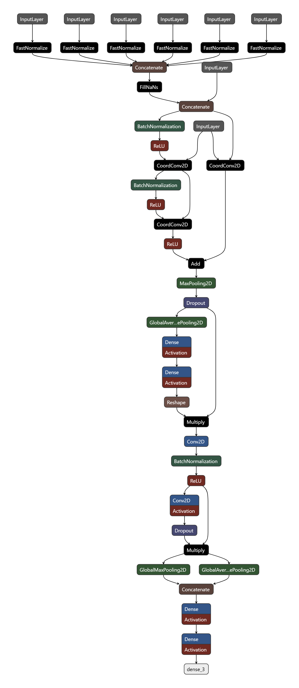
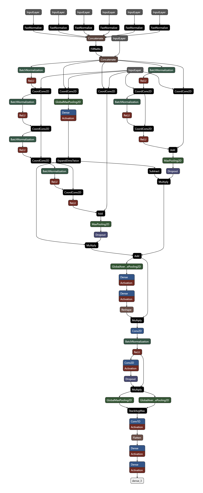

# 🌀 Tornado Prediction with Wide ResNet Ensembles

This contribution extends the [Tornet benchmark](https://github.com/mit-ll/tornet) with optimized deep learning architectures for tornado detection using polarimetric radar data. The focus is on enhancing performance via model refinement and ensembling, culminating in a lightweight and high-performing prediction pipeline that utilizes wide_resnet with a gated mechanism, as well as an 85 percent reduction in memory

---

## 📌 Overview

This project:
- Developed two ResNet-style neural network variants optimized for the Tornet dataset.
- Uses **Precision-Recall AUC** and **Threat Score** as primary metrics to evaluate model performance, albeit **AUC** is still accounted for
- Introduces a streamlined **ensemble** of Wide ResNet variants that improves robustness and precision across tornado strength levels.

---

## 🧠 Key Contributions
tornet_baseline was 18.8 MB


### ✅ Version 5 – Lightweight Wide ResNet
- 2.91 MB
- Excellent performance-to-size ratio.
- Tuned with Binary Cross-Entropy + Adam + Exponential Decay.
- Utilizes Wide Resnet implementation for more dynamic and lightweight prediction

### ✅ Version 6 – Gated Wide ResNet
- 6.44 MB
- Tuned with Binary Cross-Entropy + Adam + Exponential Decay.

- Dynamically blends shallow vs. deep inference paths for "easy" and "hard" tornado cases.
- Introduces learned gating for adaptive computation.

### 🔀 Ensemble (v5 + v6)
- Simple average ensemble of model outputs.
- Achieves a **7-point PR-AUC increase on validation** over the baseline.

---

## 📊 Evaluation Metrics

### 📈 Model Comparison Table
| Model Name | Threshold | Model parameters | AUC   | AUCPR | BinaryAccuracy | TruePositives | FalsePositives | TrueNegatives | FalseNegatives | Precision | Recall | FalseAlarmRate | F1    | CSI | val AUCPR |
|------------|-----------|------------------|-------|--------|----------------|----------------|----------------|----------------|----------------|-----------|--------|----------------|-------|--------------|------------|
| baseline   | 0.0101    | 4665409          | 0.8742| 0.5349 | 0.9456         | 915            | **635**        | **28841**      | 1076           | 0.5903    | 0.4596 | 0.0215         | 0.5168| 0.3484       |            |
| wide         | 0.4444    | 229759           | 0.8820| 0.5498 | 0.9456         | 973            | 693            | 28783          | 1018           | 0.5840    | 0.4887 | 0.0235         | 0.5321| 0.3625       | 0.5926     |
| gated         | 0.5353    | 514905           | 0.8862| 0.5574 | 0.9436         | **976**        | 761            | 28715          | **1015**       | 0.5619    | **0.4902** | 0.0258     | 0.5236| 0.3547       | 0.6031     |
| wide+gated      | 0.4898    | 744664           | **0.8928**| **0.5705** | **0.9474** | 975 | 640 | 28836 | 1016 | **0.6037** | 0.4897 | **0.0217** | **0.5408** | **0.3706** | **0.6685** |

### 📈 Cross Valdiation AUCPR

| Name     | fold 1 | fold 2 | fold 3 | fold 4 | fold 5 | Average |
|----------|--------|--------|--------|--------|--------|---------|
| baseline | 0.5121 | 0.4405 | 0.4647 | 0.4544 | 0.4451 | 0.46336 |
| wide       | 0.6184 | **0.5546** | **0.5986** | **0.6152** | **0.6072** | **0.5988** |
| gated       | **0.6401** | 0.5516 | 0.5247 | 0.5878 | 0.5716 | 0.57516 |


### 📈 Cross Valdiation AUC (taken on best run of AUCPR)

|         | fold 1 | fold 2 | fold 3 | fold 4 | fold 5 | Average |
|---------|--------|--------|--------|--------|--------|---------|
| baseline| **0.895**  | 0.8744 | 0.872  | 0.8602 | 0.8708 | 0.87448 |
| wide      | 0.892  | 0.8697 | **0.8824** | **0.8914** | **0.9077** | **0.88864** |
| gated      | 0.8893 | **0.8749** | 0.8694 | 0.8877 | 0.8927 | 0.8828  |


**Key Points:**
- Ensemble model (`v5+v6`) achieves the best overall performance across key metrics.
- Significant improvement in **Val AUCPR** and **Threat Score** compared to the baseline.
- `v5` is the most efficient model, with <10% of the parameters of the baseline.


Ensemble models consistently outperform the [baseline](https://huggingface.co/tornet-ml/tornado_detector_baseline_v1) on all major metrics.

Both Wide Resnet and the Gated Models are available [here](https://huggingface.co/Higgs32/tornet-ml-higgins)


---

## 📁 File Structure

### `scripts/tornado_detection/`
- `train_wide_resnet.py` – Training logic for Wide ResNet (WRN) variants  
- `train_gated_routing.py` – Training logic for Model v6 with learned gating mechanism  
- `test_tornado_keras_batch.py` – Batch evaluation and ensemble inference script  
- `tornet_train_cv_gated.py` – Cross-validation for gated model (AUCPR metric)  
- `tornet_train_cv_wide_resnet.py` – Cross-validation for Wide ResNet model (AUCPR)  
- `tornet_train_cv_baseline.py` – Cross-validation for baseline model (AUCPR)  
- Saved `.keras` models – Versioned model checkpoints  

### `visualizations/`
- Plots showing AUCPR performance, precision-recall tradeoffs, and model architecture comparisons  

---

## 🧪 Ensemble Evaluation Usage

```bash
python scripts/tornado_detection/test_tornado_keras_batch.py \
  --model_paths MULTIPLE_MODEL_PATHS \
  --threshold THRESHOLD
```
---

## 📷 Sample Visualizations


*Structure of Wide Resnet Implementation*


*Structure of Gated Mechanism*


DISTRIBUTION STATEMENT A. Approved for public release. Distribution is unlimited.
This material is based upon work supported by the Department of the Air Force under Air Force Contract No. FA8702-15-D-0001. Any opinions, findings, conclusions or recommendations expressed in this material are those of the author(s) and do not necessarily reflect the views of the Department of the Air Force.
© 2024 Massachusetts Institute of Technology.
The software/firmware is provided to you on an As-Is basis
Delivered to the U.S. Government with Unlimited Rights, as defined in DFARS Part 252.227-7013 or 7014 (Feb 2014). Notwithstanding any copyright notice, U.S. Government rights in this work are defined by DFARS 252.227-7013 or DFARS 252.227-7014 as detailed above. Use of this work other than as specifically authorized by the U.S. Government may violate any copyrights that exist in this work.
```
